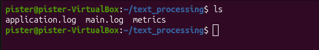
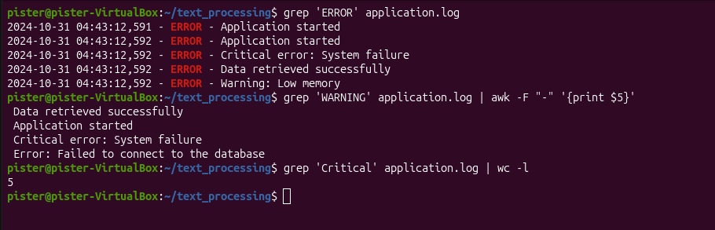
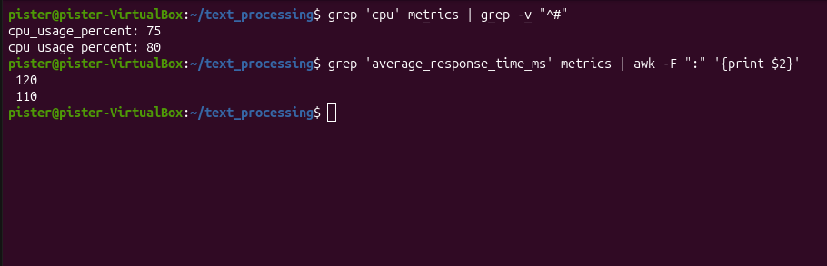
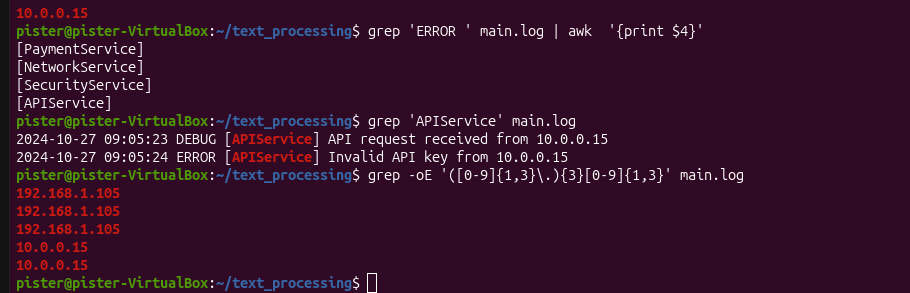
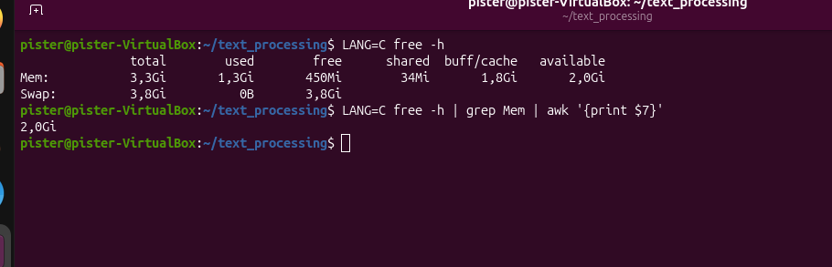

# 
TMS

## 
Home Work #6

1. В директории ``home_works`` создал директорию ``text_processing``
В директории text_processing создал файлы:
- ``application.log``
- ``metrics``
- ``main.log``

2. В файле ``application.log``
- найти все записи ``ERROR``
- найти все записи ``WARNING` и вывести для них только сообщение
- найти все записи с ``Critical`` в сообщении и посчитать их количество

3. В файле ``metrics``:
- найти метрики, относящиеся к ``cpu``
- вывести значение метрики ``average_response_time_ms``

4. В файле ``main.log``:
- найти строки, содержащие ``ERROR`` и вывести к какому сервису они относятся
- найти записи о запросах к ``APIService``
- вывести все ip-адреса

5. Выполнить команду ``free -h`` и из ее вывода получить значение столбца ``available`` (только для ``Mem``, ``Swap`` НЕ нужен)
